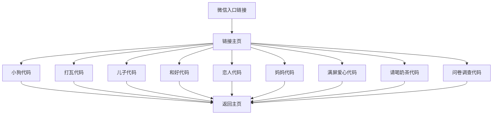

## 1. 产品概述
这是一个移动端友好的单页链接主页，整合9个不同的代码链接，用户可以通过一个入口链接在微信中访问所有功能。每个子页面都提供"返回链接主页"功能，确保用户可以轻松导航。

目标用户是需要分享多个代码链接的开发者或个人用户，通过微信一个入口即可访问所有链接，提升分享效率和用户体验。

## 2. 核心功能

### 2.1 用户角色
| 角色 | 访问方式 | 核心权限 |
|------|----------|----------|
| 访客 | 微信点击链接 | 浏览所有链接页面 |

### 2.2 功能模块
链接主页包含以下核心页面：
1. **主页**：链接列表展示，包含9个代码链接的入口
2. **子页面**：各个代码链接的独立页面，每个页面都有返回主页功能

### 2.3 页面详情
| 页面名称 | 模块名称 | 功能描述 |
|----------|----------|----------|
| 主页 | 链接列表 | 展示9个代码链接的卡片式入口，包含标题和简要描述 |
| 主页 | 顶部导航 | 显示页面标题，提供简洁的导航体验 |
| 子页面 | 内容区域 | 加载对应的代码链接内容 |
| 子页面 | 底部导航 | 提供"返回链接主页"按钮，确保用户可以轻松返回 |

## 3. 核心流程
用户通过微信点击主链接后，进入链接主页，可以看到所有代码链接的入口。点击任意链接后进入对应的子页面，子页面底部提供返回主页的功能。

## 4. 用户界面设计

### 4.1 设计风格
- **主色调**：温暖橙色 (#FF6B35) 和白色背景
- **按钮样式**：圆角矩形，阴影效果，触摸反馈
- **字体**：系统默认字体，标题16px，正文14px
- **布局风格**：卡片式布局，垂直滚动，适配手机屏幕
- **图标风格**：简洁线条图标，统一风格

### 4.2 页面设计概述
| 页面名称 | 模块名称 | UI元素 |
|----------|----------|----------|
| 主页 | 顶部导航 | 白色背景，居中标题"代码链接合集"，高度48px |
| 主页 | 链接列表 | 卡片式布局，每张卡片包含图标、标题、简短描述，间距12px |
| 子页面 | 内容区域 | 全屏iframe加载外部链接内容 |
| 子页面 | 底部导航 | 固定在底部，橙色返回按钮，高度56px |

### 4.3 响应式设计
- **移动端优先**：针对手机屏幕优化，支持iPhone和安卓设备
- **触摸优化**：按钮最小点击区域44px，支持触摸反馈
- **微信适配**：考虑微信内置浏览器的特殊性，避免使用微信限制的功能

### 4.4 微信分享优化
- **分享标题**："代码链接合集 - 一键访问所有功能"
- **分享描述**："整合多个实用代码链接，方便快捷访问"
- **分享图标**：使用统一的应用图标