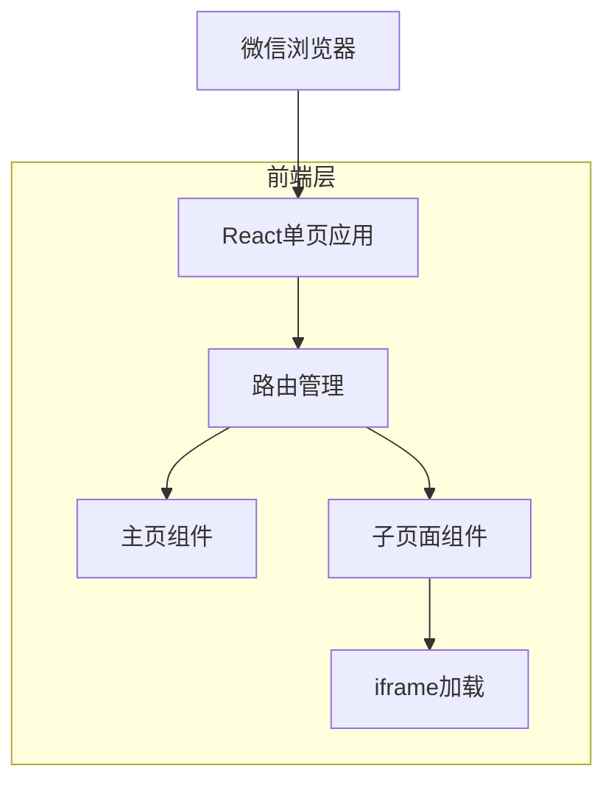

## 1. 架构设计



## 2. 技术描述

- **前端**：React@18 + Vite + TailwindCSS
- **初始化工具**：vite-init
- **路由管理**：React Router DOM
- **移动端适配**：viewport meta标签 + rem布局
- **部署**：静态文件托管（支持Netlify/Vercel/腾讯云）

## 3. 路由定义

| 路由 | 用途 |
|------|------|
| / | 链接主页，展示所有代码链接入口 |
| /xiaogou | 小狗代码页面 |
| /dawa | 打瓦代码页面 |
| /erzidaima | 儿子代码页面 |
| /hehao | 和好代码页面 |
| /lianr | 恋人代码页面 |
| /mama | 妈妈代码页面 |
| /mpaixin | 满屏爱心代码页面 |
| /naicha | 请喝奶茶代码页面 |
| /wenjuan | 问卷调查代码页面 |

## 4. 核心组件设计

### 4.1 主页组件结构
```typescript
interface LinkItem {
  id: string;
  title: string;
  description: string;
  icon: string;
  url: string;
  route: string;
}

interface HomePageProps {
  links: LinkItem[];
}
```

### 4.2 子页面组件结构
```typescript
interface SubPageProps {
  title: string;
  externalUrl: string;
  onBack: () => void;
}
```

## 5. 数据配置

### 5.1 链接数据配置
```typescript
const codeLinks = [
  {
    id: 'xiaogou',
    title: '小狗代码',
    description: '可爱的小狗动画效果',
    icon: '🐕',
    url: 'https://n.dglls.cn/xiaogou/',
    route: '/xiaogou'
  },
  {
    id: 'dawa',
    title: '打瓦代码',
    description: '有趣的打瓦游戏',
    icon: '🎮',
    url: 'https://n.dglls.cn/dawa/',
    route: '/dawa'
  },
  // ... 其他7个链接配置
];
```

### 5.2 微信分享配置
```typescript
interface WeChatShareConfig {
  title: string;
  desc: string;
  link: string;
  imgUrl: string;
}
```

## 6. 移动端优化

### 6.1 视口设置
```html
<meta name="viewport" content="width=device-width, initial-scale=1.0, maximum-scale=1.0, user-scalable=no">
```

### 6.2 触摸事件优化
- 使用touch事件替代click事件
- 防止300ms点击延迟
- 优化滚动性能

### 6.3 微信内置浏览器适配
- 避免使用微信限制的功能
- 优化页面加载速度
- 处理微信分享接口

## 7. 部署配置

### 7.1 构建配置
```bash
# 生产构建
npm run build

# 输出目录
dist/
```

### 7.2 静态托管配置
- 支持SPA路由的history模式
- 配置404页面重定向到主页
- 启用HTTPS和CDN加速